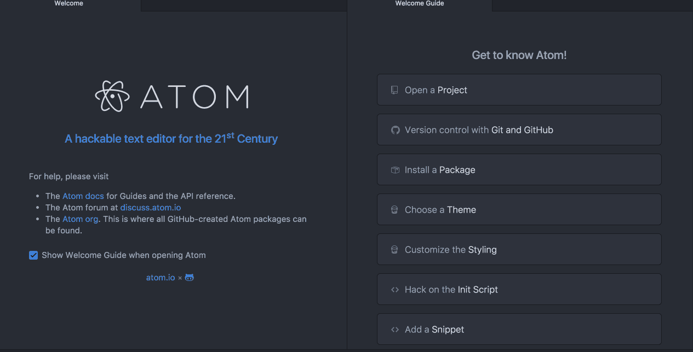

# Particle Dev package for Atom

Particle Dev is a professional, open source, hackable IDE, designed for use with the Particle devices.

## Installing

#### Particle Dev App (recommended)

Download and install the latest [Particle Dev App](https://particle.io/dev) for your operating system.

#### GitHub Atom

To get the latest, bleeding edge updates install Particle Dev packages. You'll need following dependencies:

##### Requirements

###### Windows

Install all the required tools and configurations using Microsoft's [windows-build-tools](https://github.com/felixrieseberg/windows-build-tools) using `npm install --global --production windows-build-tools` from an elevated PowerShell or CMD.exe (run as Administrator).

###### OS X

* [Xcode](https://itunes.apple.com/us/app/xcode/id497799835?ls=1&mt=12)
     * You also need to install the `Command Line Tools` via Xcode. You can find this under the menu `Xcode -> Preferences -> Downloads`
     * This step will install `gcc` and the related toolchain containing `make`

###### Linux

* [Download Atom for your distribution](https://github.com/atom/atom/releases/latest)
* Build dependencies:

	**Ubuntu / Debian**

	`$ sudo apt-get install build-essential`

	**Fedora / CentOS / RHEL**

	`$ sudo dnf --assumeyes install make gcc gcc-c++ glibc-devel`

	**Arch**

	`$ sudo pacman -S --needed gconf base-devel`

	**openSUSE**

	`$ sudo zypper install make gcc gcc-c++ glibc-devel`

##### Installation

Install [particle-dev-complete](https://atom.io/packages/console-panel) meta package. After this it will ask you to install dependencies.

## Usage

See [our documentation](https://docs.particle.io/guide/tools-and-features/dev/) to learn about how to use Particle Dev for software development.
